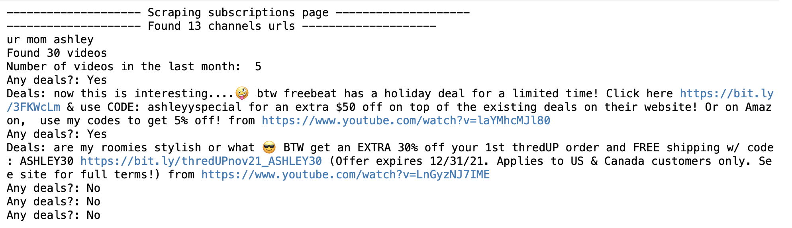

*This is the final course project for **CS 410 - Text Retrieval & Mining** course at the University of Illinois at Urbana-Champaign.*

The function of this tool is to scrape all the channels an individual is subscribed to and acquire all kinds of promo codes, deals and discounts. People spend a lot of time on Youtube watching all kinds of different videos and it can be hard to keep track of all the promotions, giveaways or discounts that they come across. Our tool will help them to identify the videos from the channels they are subscribed too that contain promotions, discounts or promo codes.

## System Requirements

  #install bs4
  pip install bs4

  #install selenium
  pip install selenium

- For Chrome, download the appropriate webdriver from here: http://chromedriver.chromium.org/downloads, unzip it and save in current directory

## Behavior

Given the url for the channels a person is subscribed to our tool retrive:

- The lists of all the channels the person is subscribed to and the channel names
- The list of the last 30 videos posted for each channel as well as the list of all these video links
- The number of videos that were posted in the last month
- The description of each video that was posted in the last month
- Any deals that are found from the descriptions of these videos

## How to use

- Import the necessary libraries and functions from selenium.webdriver
- Change the path of the driver to wherever it was downloaded
- In the **TEST SECTION** input the Youtube link to your subscribed channels

Video tutorial: https://youtu.be/vCFmeIvvwSU

## Code Walk Through

**get_subs_soup(url,driver)**
- Takes in the url and the driver as an input
- Used when scrolling is necessary to access all the subscribed channels
- Returns BeautifulSoup object that will later be used for HTML parsing

**get_soup(url,driver)**
- Similar to **get_subs_soup(url,driver)**
- Used when scraping individual Youtube videos
- Returns BeautifulSoup object that will later be used for HTML parsing

**scrape_subs_page(url,driver)**
- Takes in the url of the page that shows all the subscribed channels and the driver as an input
- Parses the loaded HTML as BeautifulSoup object
- Returns the list containing the names of all the subscribed channels
- Returns the list containing the urls of each subscriped channel

**get_all_video_links(channel_url,driver)**
- Takes in the url of the subscribed channel which was acquired from **scrape_subs_page(url,driver)** and the driver as an input
- Parses the loaded HTML as BeautifulSoup object
- Returns the list containing the titles of the last 30 videos
- Returns the list containing the urls of the last 30 videos

**get_dates_scrape(video_url,driver)**
- Takes in the url of the subscribed channel which was acquired from **scrape_subs_page(url,driver)** and the driver as an input
- Parses the loaded HTML as BeautifulSoup object
- Returns how many videos were uploaded in the last month

**get_desc(video_link,driver)**
- Takes in the url of a specific video the driver as an input
- Parses the loaded HTML as BeautifulSoup object
- Returns the description of the video

**find_deal(desc)**
- Takes in the description of the video
- Parses the loaded HTML as BeautifulSoup object
- Returns if the video contains any promotions, promo codes, discounts and sales

- **Test Section** is where you can input the desired link for the subscribed channels and get an output in the following format:
  

## Contributions

**Audrey Godsell (godsell3)**
- Worked on get_desc, debugging, and the project video

Olivia Park

**Ani Pirosmanishvili (anip2)**
- Worked on scrape_subs_page, get_all_video_links, get_dates_scrape and the Test Section
